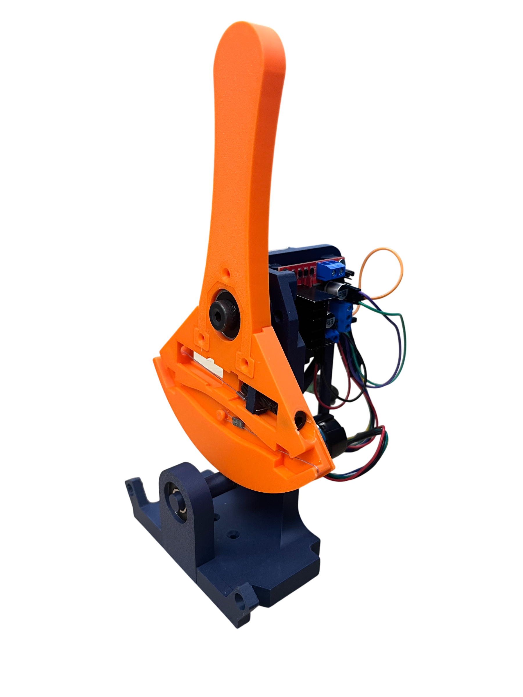
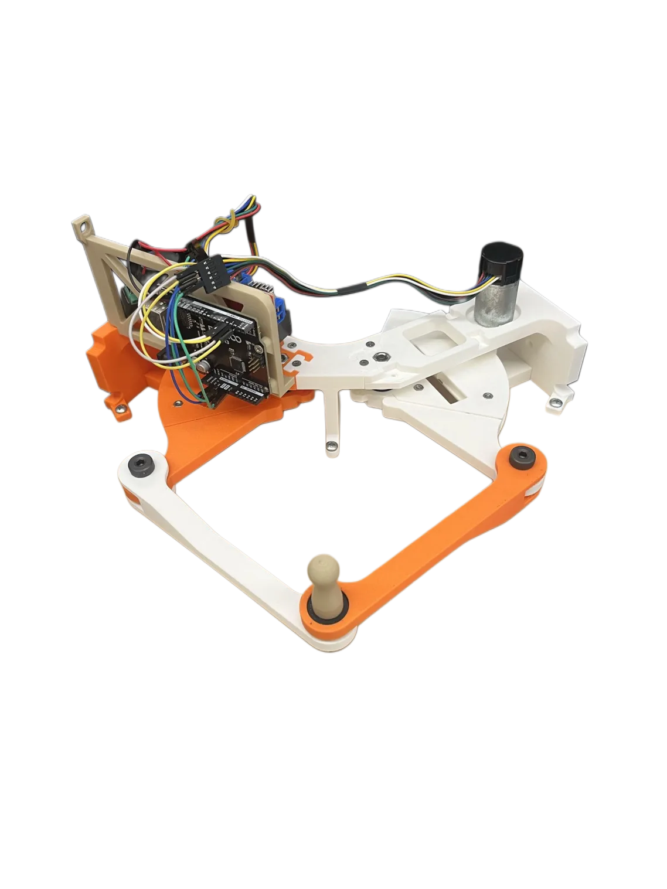

 

# The Longhorn Hapkit
### A Complete Haptic Robotics Education Ecosystem
---
###### Written by Ross Neuman and Connor McKelvey for the Human Enabled Robotics Lab at UT Austin under Professor Ann Fey.


> **A note to the reader:** The Longhorn Hapkit aims to provide a complete toolset to enable anyone to learn robotics through the interdisplinary and universal sense of touch. These low-cost devices enable students to learn mechanical design, electronics, and software engineering. Hopefully the provided documents supply an ample jumping off point for educators and ambitious students alike to look deeper into the field of robotics and create their very own projects and improvements to our ecosystem.

#### This Project Includes:
- 1 Degree of Freedom Haptic device design
    - A simple first device to build and learn what haptics is, use this to render your first artifical wall, dampener, or spring!
- 2 Degree of Freedom Haptic device design
    - Once you've mastered the 1-DOF enviroments, combine two of them into our 2-DOF design opening a world a possibilies. From teleoperation to pong games, use this device to make games or more complex simulations!
- Haplink implementation for device interfacing with Python

#### Repository Structure
```
DOCS/
    * supplemental material, diagrams, bill of materials
firmware/
    * files are numbered coresponding to /python scripts
    1DOF/
    2DOF/
    includes/ 
        * header files used by various scripts
python/
    1DOF/
    2DOF/
    tools/ 
        *helper scripts (e.g. to find connect ports)
README.md
platformio.ini *configuration file showing dependencies
```

#### Environment Setup
1. Download the Arduino IDE or VS Code with the Platform.io Extension (We will be assuming the user is using the Arduino platform)
2. Navigate to the Library Manager and install Haplink by Connor McKelvey version 1.0.3